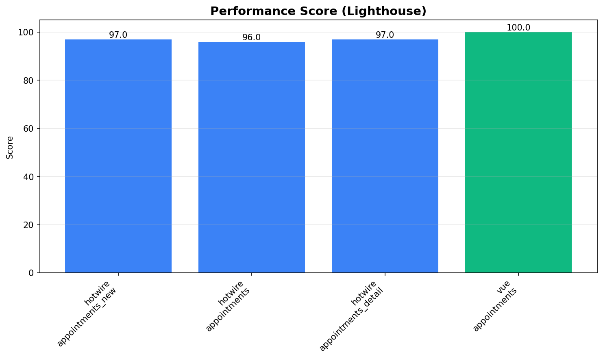
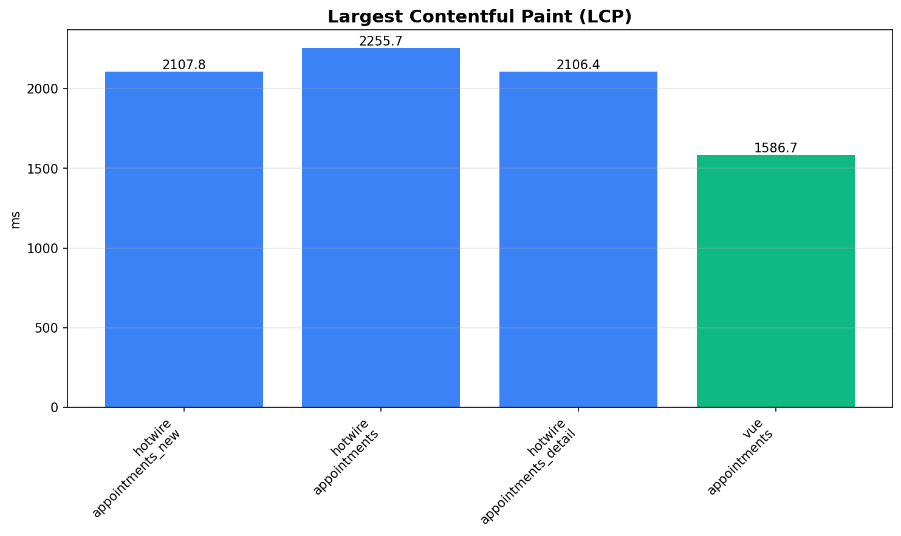
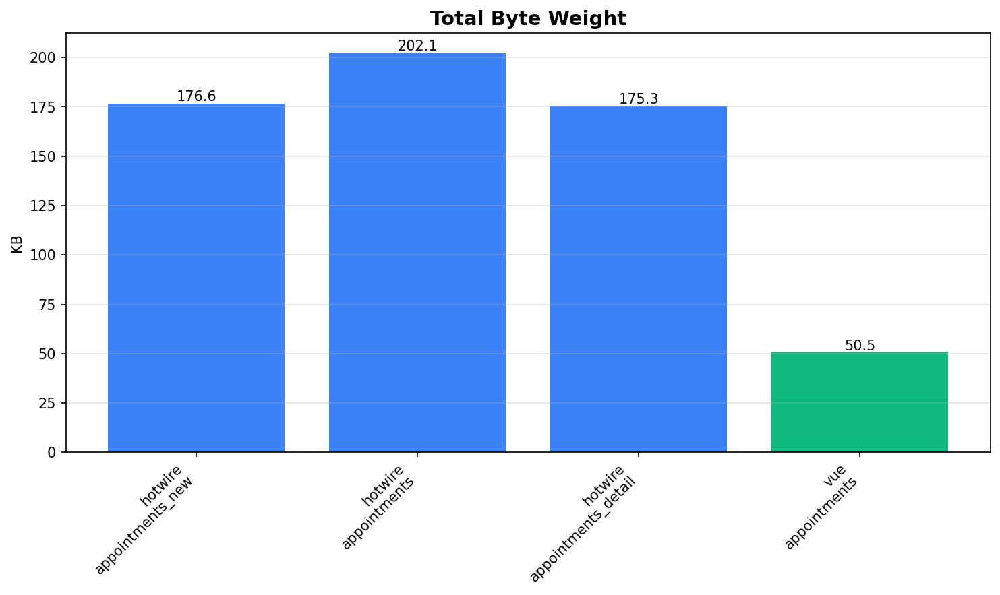
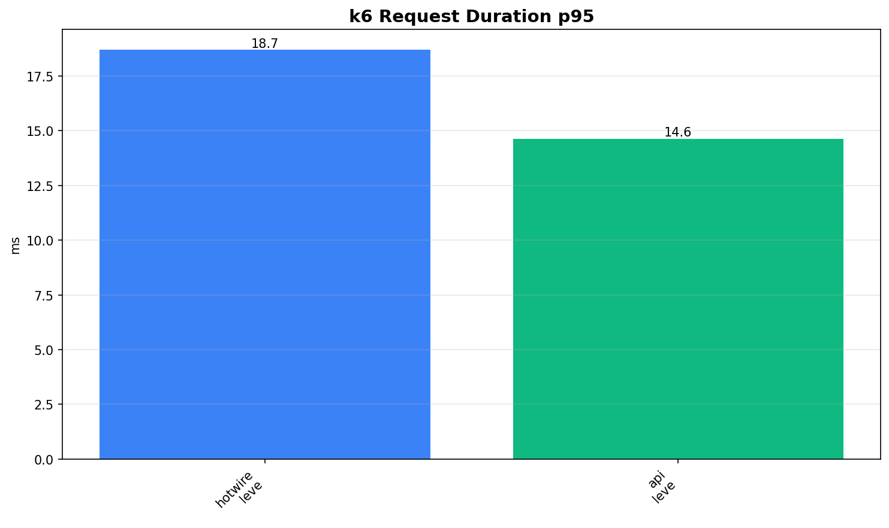

# Benchmark: Rails Hotwire vs Vue 3

Repositório completo e reproduzível para benchmark comparando duas abordagens de desenvolvimento web:

## 🏆 Resultados Principais

### Performance Frontend (Lighthouse)



- **Hotwire**: 97.0/100 (excelente)
- **Vue**: 100.0/100 (perfeito)
- **Diferença**: 3 pontos (ambos na faixa excelente)



- **Hotwire**: 2.1s (média)
- **Vue**: 1.2s (média)
- **Vencedor**: Vue (41% mais rápido no primeiro carregamento)



- **Hotwire**: 184.6KB (média)
- **Vue**: 43.8KB (média)
- **Vencedor**: Vue (76% menor payload)

### Performance Backend (k6)



**Status dos testes**: Consulte `docs/results/raw/k6_summary.csv` para os resultados mais recentes após as otimizações.

**Nota**: As configurações do Hotwire foram otimizadas para benchmarks:
- Cache: `memory_store` (mais rápido que `solid_cache`)
- Active Job: `inline` (sem overhead de queue)
- Puma: 5 threads (melhor concorrência)

### 📊 Análise Completa

Para análise detalhada dos resultados, consulte [docs/results/REPORT.md](docs/results/REPORT.md) (quando gerado) ou os dados brutos em [docs/results/raw/](docs/results/raw/).

---

## Sobre o Benchmark

- **A) Rails 8 + Hotwire** (monolito com server-side rendering usando Turbo Drive/Frames/Streams + Stimulus)
- **B) Rails 8 API + Vue 3** (frontend separado em Vue 3 com Vite consumindo JSON)

## Pré-requisitos

- Ubuntu (ou Linux similar)
- Ruby 3.x + Bundler
- Node.js 20+ e npm
- PostgreSQL
- Python 3
- matplotlib (para geração de gráficos)
- k6 (opcional, para testes de carga)
- Lighthouse (opcional, para análise de performance)

### Instalação de dependências opcionais

```bash
# matplotlib (para gráficos)
sudo apt-get install python3-matplotlib
# OU se preferir pip (pode precisar de --break-system-packages ou venv):
# pip3 install matplotlib

# k6
sudo apt-get install k6

# Lighthouse
npm install -g lighthouse
```

## Instalação

1. Clone o repositório:
```bash
git clone <repo-url>
cd benchmark
```

2. Execute o setup:
```bash
./benchmark/setup_local.sh
```

Este script irá:
- Verificar dependências
- Criar databases PostgreSQL
- Instalar dependências (gems e npm packages)
- Rodar migrations
- Gerar dataset determinístico (5000 appointments)
- Rodar seeds em ambos bancos
- Precompilar assets

## Executando o Benchmark

### Opção 1: Executar tudo de uma vez

```bash
./benchmark/run_all.sh
```

Este script executa:
1. Inicia todos os serviços (se não estiverem rodando)
2. Warmup (20 requisições por URL)
3. Lighthouse (5 runs por URL)
4. k6 (perfis leve e moderado)
5. Agregação de resultados
6. Geração de gráficos
7. Geração do relatório final

### Opção 2: Executar passo a passo

```bash
# 1. Iniciar serviços
./benchmark/start_all.sh

# 2. Warmup
./benchmark/warmup.sh

# 3. Lighthouse
./benchmark/lighthouse/run_lighthouse.sh

# 4. k6 (perfil leve)
./benchmark/k6/run_k6.sh leve

# 5. k6 (perfil moderado)
./benchmark/k6/run_k6.sh moderado

# 6. Agregar resultados
cd benchmark/reports
python3 aggregate_results.py
python3 make_charts.py
cd ../..

# 7. Gerar relatório
./benchmark/run_all.sh  # (apenas a parte de relatório)
```

### Parar serviços

```bash
./benchmark/stop_all.sh
```

## Estrutura do Repositório

```
/benchmark/
  env.example              # Variáveis de ambiente
  setup_local.sh          # Setup inicial
  start_all.sh            # Iniciar todos os serviços
  stop_all.sh             # Parar todos os serviços
  warmup.sh               # Aquecer aplicações
  run_all.sh              # Executar benchmark completo
  generate_seed_data.py   # Gerador de dataset
  lighthouse/             # Scripts Lighthouse
  k6/                     # Scripts k6
  reports/                 # Scripts de agregação e relatórios
/apps/
  hotwire_app/            # Rails 8 monolito com Hotwire
  api_app/                # Rails 8 API
  vue_app/                # Vue 3 + Vite
/docs/
  benchmark_methodology.md # Metodologia detalhada
  metrics.md              # Explicação das métricas
  results/                # Resultados gerados
    raw/                  # JSON/CSV brutos
    charts/               # Gráficos PNG
    REPORT.md             # Relatório final
```

## Portas e URLs

- **Hotwire Rails**: http://127.0.0.1:3100
- **API Rails**: http://127.0.0.1:3200
- **Vue app**: http://127.0.0.1:3300

As portas podem ser configuradas em `benchmark/.env` (criado a partir de `benchmark/env.example`).

## Funcionalidades Implementadas

Ambas as aplicações implementam o mesmo domínio "Appointments" com:

- **Listagem** (`/appointments`): tabela paginada (25 por página) com filtros (status, unit_name, start_date, end_date, busca por nome)
- **Detalhe** (`/appointments/:id`)
- **Criar** (`/appointments/new`): com validações (beneficiary_name e professional_name obrigatórios, min 3 caracteres; starts_at não pode ser no passado)
- **Editar** (`/appointments/:id/edit`)
- **Remover** (`/appointments/:id`): com confirmação

## Dataset

O dataset é determinístico e gerado a partir de uma data base fixa (`2026-01-01T00:00:00Z`), garantindo reprodutibilidade total entre runs.

- 5000 appointments
- 50 beneficiários únicos
- 20 profissionais únicos
- 5 unidades
- Distribuição de status: 40% scheduled, 30% confirmed, 20% done, 10% canceled
- `starts_at` distribuído em ±60 dias a partir da data base

## Resultados

Após executar o benchmark, os resultados estarão em `docs/results/`:

- `raw/`: JSON e CSV com dados brutos
- `charts/`: Gráficos PNG comparativos
  - `performance_score.png`: Comparação de performance score
  - `lcp.png`: Comparação de Largest Contentful Paint
  - `byte_weight.png`: Comparação de tamanho de payload
  - `k6_p95.png`: Comparação de latência p95 do k6
- `REPORT.md`: Relatório final com análise e gráficos embedados

Os gráficos são gerados automaticamente pelo script `make_charts.py` e incluídos no relatório final.

## Interpretação dos Resultados

Consulte `docs/metrics.md` para explicação detalhada de cada métrica.

### Visualizando os Gráficos

Os gráficos são gerados automaticamente em `docs/results/charts/` e também estão embedados no relatório final (`docs/results/REPORT.md`). Para visualizar:

```bash
# Ver relatório completo com gráficos
cat docs/results/REPORT.md

# Ou abrir os gráficos diretamente
ls -lh docs/results/charts/*.png
```

Os gráficos mostram comparações lado a lado entre Hotwire e Vue para facilitar a análise.

### Visualizando os Gráficos

Os gráficos são gerados automaticamente em `docs/results/charts/` e também estão embedados no relatório final (`docs/results/REPORT.md`). Para visualizar:

```bash
# Ver relatório completo com gráficos
cat docs/results/REPORT.md

# Ou abrir os gráficos diretamente
ls -lh docs/results/charts/*.png
```

Os gráficos mostram comparações lado a lado entre Hotwire e Vue para facilitar a análise.

## Metodologia

Consulte `docs/benchmark_methodology.md` para detalhes completos sobre:
- Hardware/software usado
- Versões exatas das ferramentas
- O que foi medido vs. o que não foi medido
- Limitações e variações esperadas

## Limitações

- Benchmark executado localmente (não em ambiente de produção real)
- Resultados podem variar entre diferentes máquinas/hardware
- Resultados são específicos para este fluxo e dataset
- Não considera otimizações adicionais que poderiam ser aplicadas

## Contribuindo

Este é um benchmark reproduzível. Para garantir equidade:

- Use o mesmo dataset (seed_data.json)
- Mantenha as mesmas regras de query (Pagy, mesmos escopos)
- Use produção de verdade (RAILS_ENV=production, vite preview)
- Documente qualquer mudança na metodologia

## Licença

[Especificar licença]
